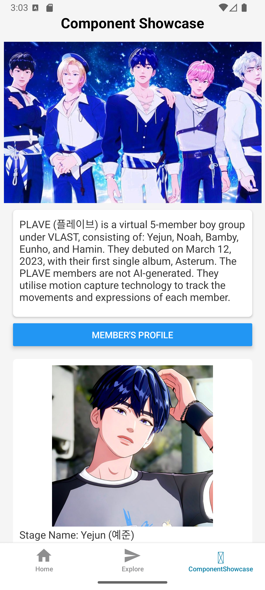
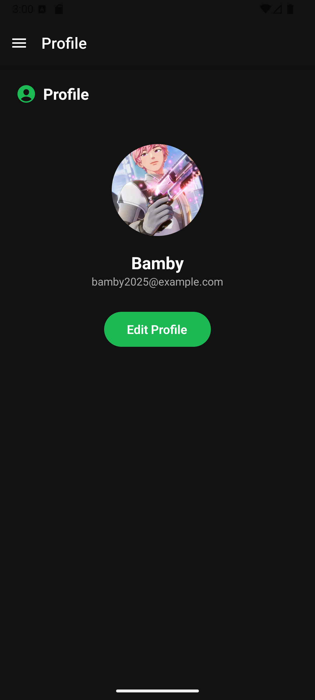

# WEEK 1-3

# WEEK 4
For this activity, I added real-time validation to the username, email, and genre fields so the user instantly sees if something’s wrong while typing. I also included a color picker so they can personalize their profile colors however they want. And for the playlist part, I made it so you can easily add new playlists or delete them anytime.

# WEEK 5
For Week 5, I added a color picker so the user can choose from a lot of different colors, and they can even delete a color by long-pressing it. I also added a dark mode option for users who prefer a darker look. On top of that, you can now change your profile picture by picking from the gallery or taking a new photo. The camera feature works inside the app, so you can snap a picture and instantly set it as your profile photo.

# WEEK 6
For the Week 6 activity, I added a map feature where you can see your current or live location in real time. You can also switch the map between light mode and dark mode using the buttons at the bottom, so the user can pick whatever look they prefer. I included zoom in and zoom out controls to make navigation easier. The map automatically follows your movement, and it loads your exact location once permissions are granted, making the whole feature feel more interactive and responsive.

